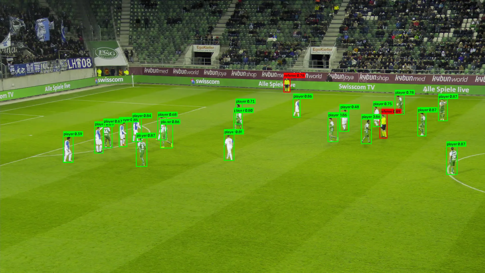
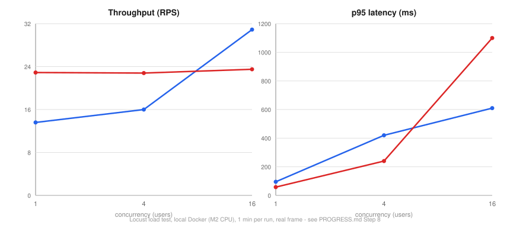

# football-detect-serve

[](https://github.com/Kushagra077/football-detect-serve/actions/workflows/tests.yml)

Football object detection (ball / goalkeeper / player / referee / other) — YOLO26 trained
on broadcast football footage, exported to ONNX, quantized to INT8, and served behind a
batching FastAPI service with a live demo on Hugging Face Spaces.

**[Live demo](https://huggingface.co/spaces/Kushagra77/football-detect-serve)** (Gradio,
ZeroGPU — see the [Live demo](#live-demo) section below for why its numbers won't match
the table below)

The point of the repo is the path from checkpoint to endpoint: every optimization step has
a gate, every backend is measured through the same code, and every number below came from
running that code, not from a spec sheet.



## Results

### Accuracy

Two evaluations, because the two splits don't mean the same thing:

- **`test`** — 3 matches that appear **nowhere** in training (different stadiums, teams,
  kits, camera setups). This is the trustworthy generalization number.
- **`val`** — carved out of the training pool (every 5th sequence), which only contains
  3 matches total. So val shares stadiums/kits/cameras with training and reads
  **optimistically**. Kept for training-time monitoring, not as a headline result.

Model lineage: **v1 nano** and **v2 small** are 10-epoch baselines. **v3 nano** is the
current nano — 20 epochs, with `copy_paste=0.3` + `mixup=0.1` added specifically to help
the rare, tiny ball class. v3 replaces v1; v1's numbers are kept as the before/after
reference.

#### test split — mAP50-95, torch, 36,750 images (the real number)

| model | all\* | ball | goalkeeper | player | referee | other |
|---|---|---|---|---|---|---|
| v1 nano (10ep baseline) | 0.344 | 0.090 | 0.377 | 0.571 | 0.435 | 0.245 |
| **v3 nano** | 0.365 | **0.111** | 0.435 | 0.594 | 0.459 | 0.225 |
| **v2 small** | 0.391 | 0.131 | 0.484 | 0.618 | 0.492 | 0.231 |

\* 5-class mean. `other` has 1,313 real instances here (none in val), so it's measurable —
poorly (~0.23), but measurable.

**v1 → v3**: ball AP **+23%** on this trustworthy split (0.090 → 0.111), every other real
class up too — the `copy_paste`/`mixup` experiment worked. (Two things changed at once —
20 epochs *and* the augmentation — so the ball gain is most likely the augmentation and
the general uplift most likely the epochs, but they can't be cleanly separated.)

#### val split — mAP50-95, 8,250 images (training-time monitoring only)

| model | backend | all\* | ball | goalkeeper | player | referee |
|---|---|---|---|---|---|---|
| off-the-shelf COCO yolo26n (remapped) | torch | 0.093 | 0.013 | 0.000 | 0.361 | 0.000 |
| v1 nano (10ep baseline) | torch | 0.427 | 0.069 | 0.475 | 0.603 | 0.560 |
| **v3 nano** | torch | 0.470 | 0.094 | 0.564 | 0.629 | 0.591 |
| **v3 nano** | onnx-fp32 | 0.470 | 0.094 | 0.564 | 0.629 | 0.591 |
| **v3 nano** | onnx-int8 | 0.436 (−0.033) | 0.080 | 0.527 | 0.587 | 0.552 |
| **v2 small** | torch | 0.487 | 0.129 | 0.575 | 0.639 | 0.605 |
| v2 small | onnx-fp32 | 0.487 | 0.129 | 0.575 | 0.639 | 0.605 |
| v2 small | onnx-int8 | 0.423 (−0.064) | 0.069 | 0.497 | 0.577 | 0.549 |

\* 4-class mean — `other` has 0 instances in val, so it's excluded. ONNX/INT8 rows are
val-only: they measure export fidelity and quantization cost, not generalization.

#### val vs test: the gap is leakage, and its shape confirms it

Like-for-like (4-class mean, `other` excluded): v3 drops 0.470 → 0.400 (**−15%**),
v1 0.427 → 0.369 (−14%), v2 0.487 → 0.431 (−11%). The drop is concentrated in
**goalkeeper and referee** (−0.09 to −0.13 each) while **player barely moves**
(−0.02 to −0.03). That's the signature of match-level leakage, not random variance:
players look the same in any match, but a keeper's kit and a ref's uniform are
match-specific — memorizing them from training only helps on a val split that reuses
those matches. `ball` is dominated by noise at this training length.

- ONNX-fp32 reproduces torch to <0.001 mAP per class (val), across v1/v2/v3 — the export
  path is faithful.
- INT8 costs 0.03-0.06 mAP50-95 (val) — v1 −0.027, v2 −0.064, v3 −0.033. On v1 the ball
  class took the biggest relative hit (~42%); on v3 it's only ~15%, so the
  `copy_paste`/`mixup`-trained ball survives quantization noticeably better.
- v1/v2 are **10-epoch**, v3 is **20-epoch** — all still deliberately short of the
  100-epoch `configs/train.yaml` target. Every number here moves with a real training run.
- **Evaluator cross-check** (`scripts/crosscheck_map.py`): running ultralytics' own
  `YOLO.val()` on v3 lands ~0.015–0.02 mAP50-95 *lower* than `eval_map.py` on both val
  and test — a small, consistent optimistic bias, same direction on every populated class,
  no structural disagreement (`other`, the class most likely to expose an averaging bug,
  agrees to 0.005). The offset is almost certainly ultralytics' `rect=True` letterboxing
  vs the square resize the serving backends use. So the tables above read a touch high in
  absolute terms; every *relative* comparison in this section is unaffected.

### Latency (single-request, CPU, Apple M2 8-core, batch=1, v3 nano)

| backend | p50 ms | p95 ms | p99 ms | img/s |
|---|---|---|---|---|
| torch | 24.9 | 27.3 | 33.7 | 39.3 |
| onnx-fp32 | 16.3 | 18.7 | 20.2 | 60.1 |
| onnx-int8 | 19.0 | 21.0 | 23.0 | 51.9 |

(Within run-to-run noise of the earlier v1 numbers — latency tracks the architecture, not
the checkpoint, and v1/v3 are both yolo26n.)

**onnx-fp32 is 1.5x torch, free** — no accuracy cost (see table above), just a different
runtime. **onnx-int8 is *slower* than fp32 on this hardware** — Apple Silicon (ARM) lacks
the x86-VNNI instructions onnxruntime's INT8 kernels are tuned for, so it's paying dequant
overhead for no speed gain. **On x86 this would likely flip**, but there is no x86 run to
confirm it against — see [Limitations](#limitations). FP16 was measured and dropped from
this table: on CPU it ties fp32 on accuracy and is *slower* (onnxruntime has no native
fp16 kernels on CPU, so it upcasts and pays the cast cost) — FP16 only helps on GPU, and
this service targets CPU.

### Load test: does batching help? (Locust, local Docker, `onnx-fp32`, 1 min/run)



| concurrency | batching | RPS | p50 ms | p95 ms | p99 ms |
|---|---|---|---|---|---|
| 1 | on | 13.6 | 72 | 95 | 120 |
| 1 | off | 22.9 | 41 | 58 | 81 |
| 4 | on | 16.0 | 260 | 420 | 630 |
| 4 | off | 22.8 | 170 | 240 | 350 |
| 16 | on | 30.9 | 500 | 610 | 1100 |
| 16 | off | 23.5 | 670 | 1100 | 1300 |

**The answer is "it depends on load," not a flat yes/no.** At concurrency 1 and 4,
batching is pure overhead — most requests never find a batch partner inside the 15ms
`MAX_WAIT_MS` window, so they pay that wait and then run solo anyway (nobatch wins on
every axis). At concurrency 16, batching wins outright — higher throughput (30.9 vs 23.5
RPS) *and* lower latency at every percentile — because enough concurrent requests land
inside the window to be grouped into one forward pass, which beats 16 single-image calls
fighting over the same 4 pinned CPU threads. Zero request failures across all six runs.

### The acceptance sentence

> The ONNX runtime gave **1.5x** for free; INT8 bought **nothing** on this CPU (ARM) and
> cost 0.03-0.06 mAP50-95 — the honest result of measuring rather than assuming, and a
> result that plausibly reverses on x86.

## Design rules

1. **One inference path per backend, no custom decode.** `app/backends/torch_backend.py`
   and `onnx_backend.py` both call ultralytics' own `YOLO(...).predict()`, which knows how
   to decode YOLO26's end-to-end (NMS-free, top-k) head — a hand-rolled decoder assuming
   the classic dense anchor-grid output silently produced garbage on this architecture
   (see git history / old PROGRESS.md entries if curious). `app/backends/base.py` now
   holds only the shared `Detection`/`to_detections()` contract both backends convert
   ultralytics' output through — no manual letterbox/decode step exists in this repo.
2. **One evaluator for every backend.** `scripts/eval_map.py` computes COCO-style AP
   itself for torch and ONNX alike through the shared `DetectorBackend.predict()`
   interface, so comparing backends never means comparing two different measurement
   methods. It's cross-checked against ultralytics' own `YOLO.val()` via
   `scripts/crosscheck_map.py` — they agree to ~0.02 mAP50-95 (see Accuracy).
3. **Parity via the same evaluator, not a separate raw-tensor diff.** ONNX-vs-torch
   fidelity is checked by running `eval_map.py` on both and comparing per-class mAP to
   3 decimal places, not by diffing raw model output tensors (which YOLO26's end-to-end
   head format makes brittle across backends).
4. **Quantize against real data.** `scripts/export_onnx.py --quantize 8` calibrates INT8
   on a sample of the *train* split (`--split train --fraction 0.01`, ~345 images) run
   through the real preprocessing path, and the result is a measured mAP drop, not an
   assumption.

## Layout

```
configs/train.yaml           epochs, imgsz, batch, augmentation, expected class map
scripts/prepare_data.py      verify class map, count instances, flag bad labels
scripts/convert_mot_to_yolo.py   MOT gt.txt + gameinfo.ini -> YOLO format
scripts/train.py              thin wrapper over ultralytics
scripts/export_onnx.py        pt -> onnx, fp32/fp16/int8, static INT8 calibration
scripts/eval_map.py           per-class mAP for ANY backend, one code path
scripts/crosscheck_map.py     eval_map.py vs ultralytics YOLO.val() - evaluator sanity check
scripts/benchmark.py          single-request latency harness -> reports/latency.json
app/main.py                   FastAPI: /predict /healthz /metrics, multi-backend registry
app/batching.py                asyncio queue + max-wait window
app/backends/                  base (contract) + torch + onnx (fp32/fp16/int8)
app/gradio_app.py              HF Space demo - calls build_backend() directly, no FastAPI
bench/locustfile.py            load test: concurrency x batching on/off
```

## Setup

```bash
python -m venv .venv && source .venv/bin/activate
pip install -r requirements.txt
```

## Testing

```bash
pytest -v
```

`tests/` covers the pure logic — batching, metric math, label validation, the API's
error paths — through a fake `DetectorBackend` (`tests/conftest.py`). No real model
weights, ML deps (torch/ultralytics/onnxruntime), or dataset content are ever touched,
so the suite runs in about a second and needs nothing beyond what's already installed
for serving. Runs automatically on every push via GitHub Actions
(`.github/workflows/tests.yml`) — that's the badge at the top of this file.

## Pipeline

```bash
# 1. dataset: convert MOT tracking labels to YOLO format, then verify + count instances
python scripts/convert_mot_to_yolo.py --src <path-to-raw-mot-data>
python scripts/prepare_data.py --skip-download --out dataset

# 2. train (hyperparameters in configs/train.yaml)
# NOTE: the actual v1/v2/v3 checkpoints were trained via a raw model.train(...)
# call in a Kaggle notebook (multi-GPU), not through this script - configs/train.yaml
# documents the current (v3) recipe for reference, but editing it does not affect a
# Kaggle run. scripts/train.py + this command is the from-scratch reproduction path.
# configs/train.yaml targets 100 epochs; v3 is a 20-epoch run.
python scripts/train.py --weights yolo26n.pt --out models/football_detection_v3.pt --set epochs=20

# 3. accuracy (one code path for every backend). --split test is the trustworthy number,
#    --split val (default) is training-time monitoring only - see Results.
python scripts/eval_map.py --backend torch --weights models/football_detection_v3.pt --split test
# optional: sanity-check eval_map.py against ultralytics' own evaluator (~0.02 mAP agreement)
python scripts/crosscheck_map.py --weights models/football_detection_v3.pt --split test --device mps

# 4. export: fp32, fp16, int8 (int8 calibrates on the train split).
#    Run --quantize none LAST - the quantized exports reuse the base filename (see below).
python scripts/export_onnx.py --weights models/football_detection_v3.pt --quantize 16
python scripts/export_onnx.py --weights models/football_detection_v3.pt --quantize 8 \
    --split train --fraction 0.01
python scripts/export_onnx.py --weights models/football_detection_v3.pt --quantize none

# 5. GATE — onnx-fp32 must match torch mAP to ~0.001/class; int8 drop must be sane, not collapsed
python scripts/eval_map.py --backend onnx --weights models/football_detection_v3.onnx
python scripts/eval_map.py --backend onnx --weights models/football_detection_v3_int8.onnx

# 6. single-request latency across backends and batch sizes
python scripts/benchmark.py
```

## Serving

```bash
MODELS="torch=models/football_detection_v3.pt,onnx-fp32=models/football_detection_v3.onnx,onnx-int8=models/football_detection_v3_int8.onnx" \
DEFAULT_BACKEND=onnx-fp32 uvicorn app.main:app --host 0.0.0.0 --port 7860
```

One process serves several backends at once — `?backend=` picks one per request, so you
can demo and load-test torch/onnx-fp32/onnx-int8 side by side without redeploying.

| Env var | Default | Notes |
| --- | --- | --- |
| `MODELS` | torch+onnx-fp32+onnx-int8 on v3 | `name=path,name=path,...` |
| `DEFAULT_BACKEND` | first entry in `MODELS` | used when `?backend=` is omitted |
| `DEVICE` | `cpu` | |
| `IMGSZ` / `CONF` / `IOU` / `MAX_DET` | `640` / `0.25` / `0.45` / `300` | postprocess defaults, overridable per request |
| `MAX_BATCH_SIZE` | `8` | dynamic batch cap |
| `MAX_WAIT_MS` | `15` | how long a request waits to be batched |
| `MAX_QUEUE_SIZE` | `256` | overflow returns 503 rather than queueing forever |

### Endpoints

```bash
# multipart upload, pick a backend, bypass batching
curl -sS -F file=@frame.jpg "localhost:7860/predict?backend=onnx-fp32&batch=false" | jq

# json (base64 or url), with per-request thresholds
curl -sS localhost:7860/predict -H 'content-type: application/json' \
  -d '{"image_b64":"<...>","options":{"conf":0.4}}' | jq

curl -sS localhost:7860/healthz | jq   # lists every loaded backend
curl -sS localhost:7860/metrics | grep fds_   # per-backend counters/histograms
```

`/predict` returns boxes in original image coordinates plus `inference_ms`, `total_ms`,
`batch_size` and `batched` — the gap between `inference_ms` and `total_ms` is decode plus
(if `batched=true`) queue wait.

### Batching

One worker task per backend drains an asyncio queue and fires a forward pass as soon as
either `MAX_BATCH_SIZE` requests are ready or `MAX_WAIT_MS` has passed since the first one
arrived. `?batch=false` skips the queue entirely for a direct comparison. State is
per-process, so run `--workers 1` and scale with replicas, not worker count.

## Docker

**Local-only.** HF Docker Spaces are a paid tier, so this image is never deployed — it
exists to run the multi-backend service under the Locust load test and produce the
latency/throughput numbers above. The public demo is the separate [Gradio
app](#live-demo) instead.

```bash
docker build -t football-detect-serve:local .
docker run --rm -p 7860:7860 football-detect-serve:local
```

Both backends decode through ultralytics now (see Design rules), so this image includes
torch + ultralytics, not just onnxruntime — about 1GB, comfortably inside a 3-4GB
container memory budget.

## Load test

```bash
locust -f bench/locustfile.py --headless -u 16 -r 16 -t 1m \
    --host http://localhost:7860 --html reports/loadtest/c16_batch.html

FDS_BATCH=false locust -f bench/locustfile.py --headless -u 16 -r 16 -t 1m \
    --host http://localhost:7860 --html reports/loadtest/c16_nobatch.html
```

Or drop `--headless` for the interactive web UI at `localhost:8089`. `FDS_IMAGE` /
`FDS_BACKEND` / `FDS_BATCH` env vars control the request; see `bench/locustfile.py` for
details. Six HTML reports (concurrency 1/4/16 x batching on/off) are in
`reports/loadtest/`.

## Live demo

The [HF Space](https://huggingface.co/spaces/Kushagra77/football-detect-serve) is a
Gradio app (`app/gradio_app.py`) that calls `build_backend()` directly — no FastAPI, no
batching queue, since it's a low-traffic demo, not the thing under load test.

HF's free tier only offers **ZeroGPU** hardware (not standalone CPU), so every backend in
the demo runs through one `@spaces.GPU`-wrapped call and *may* execute GPU-accelerated —
including the ONNX backends, since ZeroGPU makes `torch.cuda.is_available()` report `True`
everywhere in the process and ultralytics' ONNX backend touches raw CUDA internals
regardless of which execution provider you asked for. **This means the demo's relative
backend speed will not match the CPU latency table above** — that table is the real
comparison; the Space is for checking correctness and accuracy, not speed.

## Reports

| File | Written by |
| --- | --- |
| `reports/dataset.json` | `prepare_data.py` — per-class instance counts, label problems |
| `reports/accuracy.<backend>.<model>.json` | `eval_map.py` |
| `reports/latency.json`, `figures/latency.png` | `benchmark.py` |
| `reports/loadtest/*.csv`, `*.html` | Locust |

## Limitations

- **Under-trained checkpoints.** `configs/train.yaml` targets 100 epochs; v1/v2 are
  10-epoch, v3 is 20-epoch. Intentionally short — enough to build and validate the whole
  pipeline, not to maximize the model. Every number above will move with a full run.
- **`val` overlaps with training at the match level.** The training pool contains only
  3 matches; `val` is carved from it by holding out every 5th sequence, so held-out clips
  share a stadium/kit/camera with training clips from the same game. The `test` split
  (3 entirely separate matches) doesn't have this problem — it's the number to trust, and
  the [Accuracy](#accuracy) section reports both so the ~11-14% gap is visible rather than
  hidden. A cleaner fix (hold out a whole match for val) isn't really available with only
  3 training matches — this is a dataset-size constraint, not just a split bug.
- **The `other` class is thinly validated.** It has 0 instances in `val` (AP undefined
  there) and only 1,313 in `test` — where it scores ~0.24 and both models over-predict it.
  Worth a 4-class mAP alongside the 5-class one, or folding `other` into `player`, later.
- **One degenerate box in the raw source labels**, not introduced by conversion: one
  sequence's `gt.txt` has a `w=0` row. Left as-is rather than patched around.
- **Latency numbers are ARM (Apple M2), not x86.** The Docker service that produced them
  is local-only and never deployed to an x86 host, so the "INT8 is slower than fp32"
  result is plausibly an ARM/x86 kernel-tuning artifact (onnxruntime's INT8 kernels are
  x86-VNNI tuned), not a property of the model. There is no x86 run to confirm or deny
  this.
- **`imgsz=640`, not 1280.** A documented tradeoff, not an oversight — it protects the CPU
  latency story that is the point of this phase. Recovering small/distant ball detections
  with tiled high-res inference is out of scope here.
- **Out of scope for this phase:** tracking, video input, team assignment, TensorRT, a
  fancier frontend than the Gradio demo.

## License

[MIT](LICENSE) — covers the code in this repository only. No training data or model
weights are distributed here; see the repo's `.gitignore` and the Setup section above.
